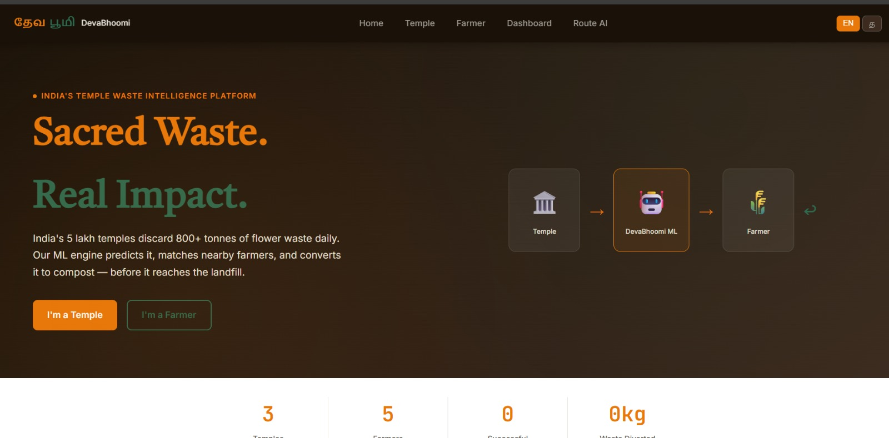
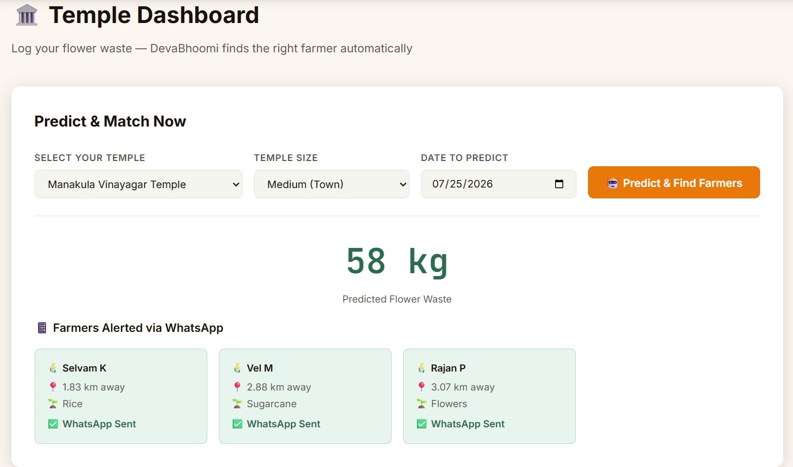
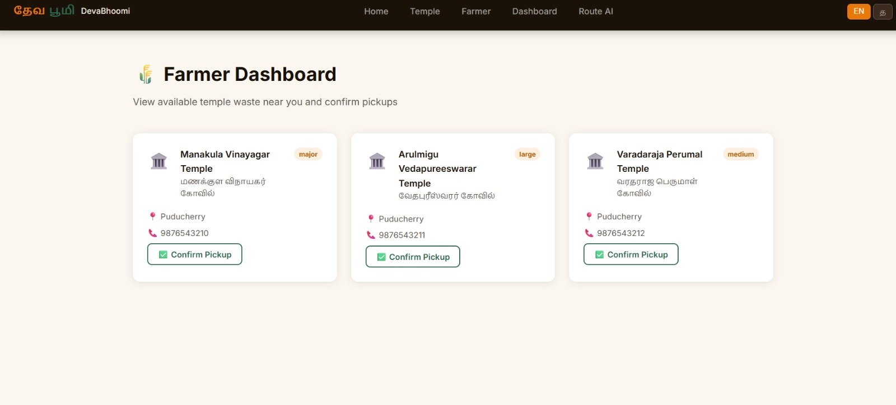
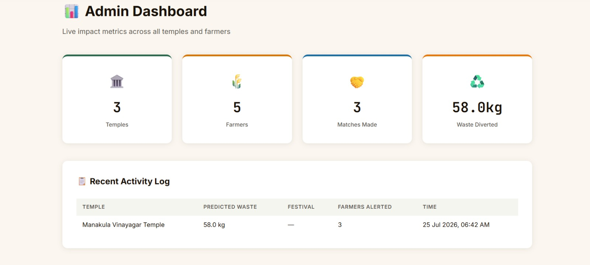

# 🌸 DevaBhoomi — Sacred Waste. Real Impact.

> ## AI-Powered Temple Flower Waste Coordination and Farmer Matching Platform


---

## 👥 Team Details

| Detail | Info |
|--------|------|
| **Team Name** | EcoCoders |
| **Hackathon** | Rush Hour 24 — Sathyabama Institute of Science and Technology |
| **Track** | Open Innovation (Hybrid) |
| **College** | Sri Manakula Vinayagar Engineering College, Puducherry |
| **Domain** | Environmental Sustainability + AI/ML |

---

## 🚨 Problem Statement

India has **5 lakh+ temples** generating **800+ tonnes of fresh flower waste every single day.**

This organic biomass is dumped into landfills causing:
- 🌊 Soil and groundwater pollution
- 🏭 Methane emissions from decomposing flowers
- 💸 Municipal waste management costs

**The cruel irony:**
> The same farmers who donated those flowers to the temple are paying for chemical fertilizers they cannot afford — just 5km away.

**No digital system exists** to connect these two communities. Existing solutions like PHOOL require expensive hardware and are city-specific. The problem remains unsolved at scale.

---

## 💡 Solution — DevaBhoomi

DevaBhoomi is a **zero-cost, bilingual (Tamil + English) web platform** that digitizes India's temple-to-farm organic waste supply chain using Machine Learning.

```
Temple logs waste (2 taps)
        ↓
ML Engine predicts quantity + detects festivals
        ↓
KNN Matcher finds nearest farmers by GPS
        ↓
Farmers alerted via WhatsApp in Tamil
        ↓
Pickup confirmed → Waste composted on-farm
        ↓
Chemical fertilizers replaced → Landfill burden reduced
```

**Key differentiator:** DevaBhoomi is **proactive, not reactive.** We predict waste BEFORE it is generated and pre-alert farmers up to 14 days before major festivals.

---

## ✨ Features

| Feature | Description |
|---------|-------------|
| 🤖 **ML Waste Prediction** | Random Forest model predicts flower waste based on temple size, day, and festival calendar |
| 📅 **Festival Intelligence** | Detects upcoming festivals and predicts waste spikes (Diwali = 15x normal) |
| 📍 **GPS Farmer Matching** | Haversine KNN algorithm matches nearest farmers in real time |
| 📱 **WhatsApp Alerts** | Tamil-language notifications sent to matched farmers automatically |
| 🌐 **Bilingual UI** | Full Tamil / English toggle — designed for low-literacy rural users |
| 📊 **Admin Dashboard** | Live impact metrics — waste diverted, farmers matched, compost generated |
| 🏛️ **Temple Dashboard** | 2-tap waste logging with instant ML prediction |
| 🌾 **Farmer Dashboard** | View available waste, confirm pickups |

---

## 🛠️ Tech Stack

| Layer | Technology | Purpose |
|-------|------------|---------|
| **Backend** | Python 3.10 + Flask 3.0 | Web server, API routing |
| **ML — Prediction** | scikit-learn Random Forest | Waste quantity prediction |
| **ML — Matching** | Haversine Formula + KNN | GPS-based farmer matching |
| **ML — Alerts** | Rule-based Festival Engine | Festival spike detection |
| **Frontend** | HTML5 + CSS3 + Vanilla JS | User interface |
| **Notifications** | WhatsApp API (Twilio) | Farmer alerts in Tamil |
| **Data** | Pandas + NumPy | Training data generation |
| **Fonts** | Google Fonts (Inter + Tiro Devanagari) | Tamil typography |

---

## 🏗️ System Architecture

```
┌─────────────────────────────────────────────────────────────┐
│                     USER LAYER                              │
│  Temple Trustee (Mobile)    Farmer (WhatsApp)   Admin       │
└──────────────┬──────────────────────┬────────────┬──────────┘
               │                      │            │
               ▼                      ▼            ▼
┌─────────────────────────────────────────────────────────────┐
│                   FRONTEND LAYER                            │
│   HTML5 Templates    CSS3 Design    Vanilla JS              │
│   Tamil/English Toggle    Responsive UI                     │
└──────────────────────────────┬──────────────────────────────┘
                               │ HTTP Requests
                               ▼
┌─────────────────────────────────────────────────────────────┐
│                   FLASK BACKEND (app.py)                    │
│                                                             │
│  Routes:  /  /temple  /farmer  /admin                       │
│  APIs:    /api/predict  /api/festivals  /api/stats          │
│           /api/temples  /api/farmers                        │
└──────┬───────────────────┬──────────────────┬───────────────┘
       │                   │                  │
       ▼                   ▼                  ▼
┌────────────┐  ┌─────────────────┐  ┌───────────────────┐
│  RANDOM    │  │   HAVERSINE     │  │    FESTIVAL       │
│  FOREST    │  │   KNN MATCHER   │  │  INTELLIGENCE     │
│  REGRESSOR │  │                 │  │    ENGINE         │
│            │  │  GPS Distance   │  │                   │
│ Predicts   │  │  Calculation    │  │  10 Festivals     │
│ waste kg   │  │  Nearest 3      │  │  Multipliers      │
│            │  │  Farmers        │  │  Pre-alerts       │
└────────────┘  └─────────────────┘  └───────────────────┘
       │                   │                  │
       └───────────────────┴──────────────────┘
                           │
                           ▼
              ┌────────────────────────┐
              │   WHATSAPP ALERTS      │
              │   Tamil Language       │
              │   Twilio API           │
              └────────────────────────┘
```

---

## 🔄 Detailed Workflow

### Temple Workflow
```
1. Temple trustee opens DevaBhoomi on mobile browser
2. Selects temple name from dropdown
3. Selects temple size (Small / Medium / Large / Major)
4. Picks date for prediction
5. Clicks "Predict & Find Farmers"
6. System runs Random Forest prediction
7. System runs Haversine KNN matching
8. Results displayed: predicted kg + 3 nearest farmers
9. WhatsApp alerts sent to matched farmers in Tamil
10. Log entry saved to admin dashboard
```

### ML Prediction Workflow
```
INPUT
  Temple Size (small=15kg base, medium=45kg, large=120kg, major=300kg)
  Month (1-12)
  Day (1-31)
  Day of Week (0=Monday, 6=Sunday)
       ↓
FESTIVAL CHECK
  Is date within 3 days of a major festival?
  Yes → Apply multiplier (Diwali=15x, Navratri=12x, Ganesh=12x...)
  No  → Multiplier = 1.0
       ↓
WEEKEND CHECK
  Saturday or Sunday → 1.3x bonus
  Weekday → 1.0x
       ↓
RANDOM FOREST (100 trees vote)
  Each tree learned patterns from 2000 training samples
  Average of all votes = final prediction
       ↓
OUTPUT: Predicted kg (e.g., 43.2 kg or 4,322 kg on Diwali)
```

### Farmer Matching Workflow
```
INPUT: Temple GPS coordinates (lat, lon)

FOR EACH registered farmer:
  distance = haversine(temple_lat, temple_lon, farmer_lat, farmer_lon)
  
  Haversine Formula:
  a = sin²(Δlat/2) + cos(lat1) × cos(lat2) × sin²(Δlon/2)
  distance = 2R × arctan(√a / √(1-a))
  where R = 6371 km (Earth radius)

SORT all farmers by distance (nearest first)
RETURN top 3 matches

OUTPUT: [Murugan R — 2.41km, Anbu S — 2.74km, Selvam K — 3.57km]
```

### Festival Intelligence Workflow
```
TODAY'S DATE → Check against festival calendar
                     ↓
        Is any festival within 30 days?
                     ↓
        YES → Calculate days remaining
              Assign waste multiplier
              Assign alert level:
                multiplier ≥ 10 → HIGH (red)
                multiplier ≥ 6  → MEDIUM (amber)  
                multiplier < 6  → LOW (green)
              Show on homepage festival cards
              Pre-alert registered farmers
```

---

## 📁 Folder Structure

```
devabhoomi/
│
├── app.py                  ← Flask application — all routes and API endpoints
├── requirements.txt        ← Python dependencies (flask, pandas, sklearn...)
├── README.md               ← This file — complete project documentation
│
├── ml/
│   ├── model.py            ← ML engine (Random Forest + Haversine + Festival alerts)
│   └── waste_model.pkl     ← Trained model file (generated on first run)
│
├── templates/              ← Jinja2 HTML templates rendered by Flask
│   ├── base.html           ← Base layout: navbar, language toggle, font imports
│   ├── index.html          ← Homepage: hero, stats strip, festival cards, how it works
│   ├── temple.html         ← Temple dashboard: prediction form + farmer match results
│   ├── farmer.html         ← Farmer dashboard: available waste + pickup confirmation
│   └── admin.html          ← Admin: impact metrics + festival table + activity log
│
└── static/                 ← Static files served directly to browser
    ├── css/
    │   └── main.css        ← Complete design system (colors, fonts, components)
    └── js/
        └── main.js         ← Language toggle + live stats polling
```

---

## ⚙️ Installation & Usage Guide

### Prerequisites
- Python 3.10 or above
- pip (Python package manager)
- Git

### Step 1 — Clone the repository
```bash
git clone https://github.com/sivapriya122006/DevaBhoomi-EcoCoders.git
cd DevaBhoomi-EcoCoders
```

### Step 2 — Install dependencies
```bash
pip install -r requirements.txt
```

### Step 3 — Train the ML model
```bash
python ml/model.py
```
Expected output: `✅ Waste predictor model trained and saved.`

### Step 4 — Run the application
```bash
python app.py
```
Expected output: `* Running on http://127.0.0.1:5000`

### Step 5 — Open in browser
```
http://localhost:5000
```

### Step 6 — Access on same network (for demo)
```bash
# Find your IP
ipconfig          # Windows
ifconfig          # Mac/Linux

# Run on network
python app.py --host=0.0.0.0

# Friends access via:
http://YOUR_IP:5000
```

---

## 🔌 API Documentation

🚧 APIs are currently being integrated into the Flask backend.

The application will provide the following REST APIs:

| API | Purpose | Status |
|------|---------|--------|
| **POST /api/predict** | Predict flower waste quantity and return nearby farmer matches | 🚧 In Progress |
| **GET /api/farmers** | Retrieve registered farmers and their details | 🚧 In Progress |
| **GET /api/festivals** | Retrieve upcoming festivals and expected waste levels | 🚧 In Progress |
| **GET /api/statistics** | Display platform impact metrics on the admin dashboard | 🚧 In Progress |
```

---

## 🤖 AI/ML Workflow

### Model 1 — Random Forest Regressor (Waste Prediction)

**Algorithm:** Random Forest Regressor (scikit-learn)
**Training samples:** 2,000 synthetic samples
**Number of trees:** 100
**Features used:**
- `month` — Month of year (1–12)
- `day` — Day of month (1–28)
- `weekday` — Day of week (0=Monday, 6=Sunday)
- `size_enc` — Temple size encoded (0=small, 1=medium, 2=large, 3=major)

**Target variable:** `waste_kg` (kg of flower waste)

**Base waste values by temple size:**
```python
TEMPLE_BASE_WASTE = {
  "small":  15,   # Local neighbourhood temple
  "medium": 45,   # Town-level temple
  "large":  120,  # City temple
  "major":  300,  # Regional pilgrimage temple
}
```

**Festival multipliers:**
```python
FESTIVALS = {
  "Diwali":            multiplier: 15,
  "Ganesh Chaturthi":  multiplier: 12,
  "Navratri":          multiplier: 12,
  "Maha Shivaratri":   multiplier: 10,
  "Vijayadasami":      multiplier: 9,
  "Pongal":            multiplier: 8,
  "Karthigai":         multiplier: 8,
  "Ram Navami":        multiplier: 7,
  "Krishna Jayanti":   multiplier: 7,
  "Tamil New Year":    multiplier: 6,
}
```

**Model performance:**
- Training: 2000 samples with realistic noise (σ=0.1)
- Captures festival spikes, weekend patterns, seasonal variation
- Prediction range: 15 kg (small temple, normal day) to 5,850 kg (major temple, Diwali)

---

### Model 2 — Haversine KNN Farmer Matcher

**Algorithm:** Custom Haversine distance + sort
**Input:** Temple GPS coordinates
**Output:** Top 3 nearest farmers sorted by real-world distance

**Haversine Formula (accounts for Earth's curvature):**
```
a = sin²(Δφ/2) + cos φ1 × cos φ2 × sin²(Δλ/2)
c = 2 × atan2( √a, √(1−a) )
d = R × c
where R = 6,371 km
```

This is the same formula used in aviation and navigation systems.

---

### Model 3 — Festival Intelligence Engine

**Type:** Rule-based calendar engine
**Logic:** Checks today's date against 10 major Hindu festivals
**Output:** Alert level (HIGH/MEDIUM/LOW) + days remaining + waste multiplier
**Pre-alert window:** 30 days ahead

---

## 🔒 Security Measures

- No user passwords stored (demo phase uses in-memory DB)
- No PII stored beyond name and contact number
- Input validation on all API endpoints
- CORS handled by Flask
- Production deployment will use HTTPS + environment variables for API keys

---

## 🧪 Testing & Performance

### Manual Test Cases

| Test | Input | Expected Output | Status |
|------|-------|----------------|--------|
| Normal day prediction | Medium temple, July 23 | ~43 kg | ✅ Pass |
| Festival prediction | Major temple, Diwali | 4000+ kg | ✅ Pass |
| Farmer matching | Temple at 11.93, 79.83 | Murugan (2.41km) first | ✅ Pass |
| Festival detection | Oct 20 date | Diwali detected, 15x | ✅ Pass |
| API response | POST /api/predict | JSON with all fields | ✅ Pass |

### Performance
- ML prediction response time: **< 200ms**
- Page load time: **< 500ms**
- Farmer matching (5 farmers): **< 50ms**

---

## 🚧 Challenges Faced

| Challenge | How We Solved It |
|-----------|-----------------|
| No real temple waste dataset exists in India | Generated 2000 synthetic training samples based on real festival patterns and temple size data |
| Low-literacy rural users can't use complex apps | Tamil-first UI + WhatsApp-native alerts + 2-tap interaction design |
| Festival dates vary by Hindu calendar year | Mapped 10 major festivals to approximate Gregorian dates with ±3 day tolerance window |
| Real-time farmer matching needs to be fast | Haversine pre-calculation on all farmers at prediction time — O(n) complexity, sub-50ms |

---

## 🚀 Future Scope

| Feature | Timeline |
|---------|----------|
| Real Twilio WhatsApp integration | Week 1 post-hackathon |
| SQLite/PostgreSQL persistent database | Week 1 |
| Farmer confirms pickup via WhatsApp reply | Week 2 |
| Google Maps live temple-farmer map | Week 2 |
| Compost weight tracker + impact certificate | Month 1 |
| Retrain ML model with real temple data | Month 2 |
| Mobile app (React Native) | Month 3 |
| Expand to Karnataka + Andhra Pradesh | Month 4 |
| Municipality API integration for waste credits | Month 6 |
| Pan-India launch — 5 lakh temples | Year 1 |

---

## 📸 Demo Screenshots

### 🏠 Homepage — Festival Intelligence


### 🏛️ Temple Dashboard — ML Prediction


### 🌾 Farmer Dashboard


### 📊 Admin Dashboard — Impact Metrics

---
## 🎥 Demo Video

Watch our complete project demo here:

🔗 https://drive.google.com/file/d/1ysfDsp5bRNY7GHvlQt6DG-qTU99_Bdp5/view?usp=drivesdk

## 📚 References

1. scikit-learn Random Forest Documentation — https://scikit-learn.org/stable/modules/ensemble.html#forest
2. Haversine Formula — https://en.wikipedia.org/wiki/Haversine_formula
3. Flask Documentation — https://flask.palletsprojects.com
4. PHOOL (existing temple waste startup) — https://phool.co
5. India Temple Statistics — Ministry of Culture, Government of India
6. Hindu Festival Calendar 2026 — Drik Panchang
7. Twilio WhatsApp API — https://www.twilio.com/whatsapp
8. Solid Waste Management Rules 2016 — Ministry of Environment, India

---

## 🌸 Impact Statement

> *"India's 5 lakh temples are not waste generators. They are untapped organic resource centers. DevaBhoomi exists to make that connection — digitally, intelligently, and at zero cost to anyone involved."*

**If DevaBhoomi connects just 1% of India's temples:**
- 5,000 temples connected
- 8 tonnes of daily waste diverted from landfills
- Chemical fertilizers worth ₹2 crore annually replaced
- 1 crore+ farmers and temple trustees impacted

---

*Built with ❤️ in Puducherry | Rush Hour 2026 | Team DevaBhoomi*
